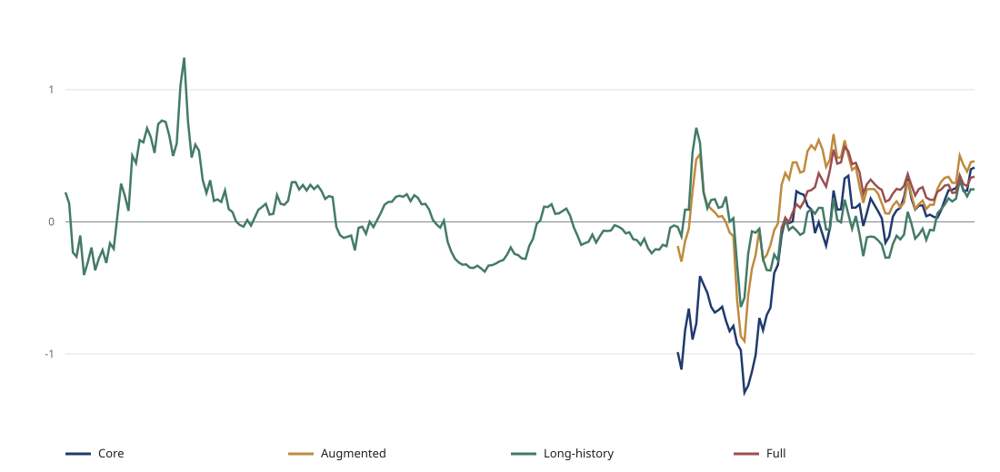

# 住房金融条件指数（HFCI）：构建方法与回测报告

_数据截至 2026-08-20。本报告由 `property_data.json` 可复现生成。_

## 1. 构建目的

住房金融条件指数（Housing Financial Conditions Index, HFCI）用少量、透明的月度指标概括澳大利亚住房融资的价格、信贷可得性和家庭偿付能力。其用途是识别周期转折、比较不同阶段，并检验金融条件是否包含对未来住房活动有用的信息。它不是官方统计、估值模型或因果估计。

正值表示相对于当时可获得历史而言金融条件偏紧，负值表示偏松。四个版本在近期信息丰富度和长期覆盖之间作出不同取舍：

| 版本 | 主要用途 | 主要取舍 |
|---|---|---|
| Core | 当前金融价格信号 | 新发按揭利率历史较短，因此共同样本较短 |
| Augmented | Core 加信贷数量和家庭能力 | 覆盖更广，但部分数量指标可能具有内生性 |
| Long-history | 周期分析和长期回测 | 省略较新的借款人结构指标 |
| Full | 近期压力、偿付负担与信贷标准监测 | 共同样本最短 |

## 2. 构建方法

对原始序列 \(x_{i,t}\)，先进行预设的经济含义转换：

**(1)** \( q_{i,t} = g_i(x_{i,t}) \)

随后统一方向，使数值越高始终表示条件越紧：

**(2)** \( a_{i,t} = s_i q_{i,t}, \quad s_i \in \{-1,+1\} \)

为近似历史时点的信息集，根据估计发布滞后 \(L_i\) 平移观测：

**(3)** \( a^*_{i,t} = a_{i,t-L_i} \)

标准化仅使用截至当时的扩展样本，防止未来观测改变历史 z-score：

**(4)** \( z_{i,t} = (a^*_{i,t}-\bar a^*_{i,1:t})/\sigma_{i,1:t} \)

变量先在经济模块 \(b\) 内等权平均：

**(5)** \( B_{b,t} = N_{b,t}^{-1}\sum_{i\in b} z_{i,t} \)

再对当时可用的模块等权平均：

**(6)** \( HFCI_t = K_t^{-1}\sum_{b=1}^{K_t}B_{b,t} \)

网页显示的历史分位数采用扩展历史排名：

**(7)** \( P_t = 100\times rank(HFCI_t\mid HFCI_{1:t})/t \)

## 3. 输入数据与描述性统计

下表统计的是完成经济转换、但尚未进行方向调整、发布滞后和平滑标准化之前的输入。只有在构建规则明确要求时，低频数据才会向前填充。

| 模块 | 变量 | 转换后跨度 | N | 最小值 | Q1 | 中位数 | 均值 | Q3 | 最大值 | 标准差 | 发布滞后（月） | 来源 |
|---|---|---:|---:|---:|---:|---:|---:|---:|---:|---:|---:|---|
| Pricing | Real cash rate | 1990-03–2026-06 | 156 | -4.05 | -0.01 | 1.77 | 1.63 | 3.05 | 9.80 | 2.22 | 1 | [Reserve Bank of Australia](https://www.rba.gov.au/statistics/cash-rate/) + [ABS Consumer Price Index, Australia](https://www.abs.gov.au/statistics/economy/price-indexes-and-inflation/consumer-price-index-australia/latest-release) |
| Pricing | New owner-occupier mortgage rate | 2019-07–2026-06 | 84 | 2.40 | 2.70 | 5.00 | 4.45 | 6.00 | 6.30 | 1.58 | 1 | [RBA Statistical Table F6 (Housing Lending Rates)](https://www.rba.gov.au/statistics/tables/csv/f6-data.csv) |
| Pricing | Real new mortgage rate | 2019-07–2026-06 | 84 | -3.10 | -0.77 | 1.60 | 0.92 | 2.32 | 3.90 | 2.04 | 1 | [RBA Statistical Table F6 (Housing Lending Rates)](https://www.rba.gov.au/statistics/tables/csv/f6-data.csv) + [ABS Consumer Price Index, Australia](https://www.abs.gov.au/statistics/economy/price-indexes-and-inflation/consumer-price-index-australia/latest-release) |
| Pricing | Mortgage spread to cash rate | 2019-07–2026-06 | 84 | 1.80 | 1.90 | 1.95 | 2.13 | 2.40 | 2.75 | 0.27 | 1 | [RBA Statistical Table F6 (Housing Lending Rates)](https://www.rba.gov.au/statistics/tables/csv/f6-data.csv) + [Reserve Bank of Australia](https://www.rba.gov.au/statistics/cash-rate/) |
| Market Pricing | Australian five-year government yield | 2017-01–2026-07 | 115 | 0.30 | 1.27 | 2.37 | 2.49 | 3.64 | 4.75 | 1.33 | 1 | [RBA Statistical Table F17 (Indicative Mid Rates of Australian Government Securities)](https://www.rba.gov.au/statistics/tables/csv/f17-yields.csv) |
| Market Pricing | BBB financing spread | 2005-01–2026-07 | 259 | 0.54 | 1.32 | 2.12 | 2.22 | 2.64 | 8.06 | 1.25 | 1 | [RBA Statistical Table F3 (Aggregate Measures of Australian Corporate Bond Yields)](https://www.rba.gov.au/statistics/tables/csv/f3-data.csv) + [Reserve Bank of Australia](https://www.rba.gov.au/statistics/cash-rate/) |
| Market Pricing | A-REIT relative annual return | 2005-04–2026-08 | 257 | -41.76 | -10.60 | -2.30 | -3.00 | 5.95 | 23.87 | 12.99 | 1 | [S&P/ASX 200 A-REIT Index](https://www.spglobal.com/spdji/en/indices/equity/sp-asx-200-a-reit/) + [S&P/ASX 200](https://www.asx.com.au/markets/trade-our-cash-market/overview/indices) |
| Credit Availability | Housing credit growth | 1977-08–2026-06 | 587 | 3.00 | 6.70 | 11.90 | 11.41 | 15.50 | 23.20 | 5.13 | 1 | [RBA Statistical Table D1 (Growth in Financial Aggregates)](https://www.rba.gov.au/statistics/tables/csv/d1-data.csv) |
| Credit Availability | Owner-occupier housing credit growth | 1991-01–2026-06 | 426 | 3.80 | 6.10 | 8.80 | 9.81 | 12.70 | 19.90 | 4.23 | 1 | [RBA Statistical Table D1 (Growth in Financial Aggregates)](https://www.rba.gov.au/statistics/tables/csv/d1-data.csv) |
| Credit Availability | Investor housing credit growth | 1991-01–2026-06 | 426 | -0.70 | 4.90 | 10.40 | 12.71 | 20.58 | 40.20 | 9.49 | 1 | [RBA Statistical Table D1 (Growth in Financial Aggregates)](https://www.rba.gov.au/statistics/tables/csv/d1-data.csv) |
| Credit Availability | New dwelling lending growth | 2017-Q2–2026-Q2 | 37 | -29.82 | -7.82 | 8.30 | 8.31 | 17.83 | 83.23 | 23.10 | 2 | [ABS Lending Indicators](https://www.abs.gov.au/statistics/economy/finance/lending-indicators/latest-release) |
| Credit Availability | High-DTI lending share | 2019-Q1–2026-Q1 | 29 | 5.00 | 5.78 | 14.56 | 12.59 | 17.08 | 24.33 | 6.78 | 3 | [APRA Quarterly ADI Property Exposures](https://www.apra.gov.au/news-and-publications/quarterly-authorised-deposit-taking-institution-statistics) |
| Credit Availability | High-LVR lending share | 2019-Q1–2026-Q1 | 29 | 5.52 | 6.67 | 7.28 | 7.81 | 9.17 | 11.34 | 1.55 | 3 | [APRA Quarterly ADI Property Exposures](https://www.apra.gov.au/news-and-publications/quarterly-authorised-deposit-taking-institution-statistics) |
| Credit Availability | Interest-only lending share | 2019-Q1–2026-Q1 | 29 | 17.54 | 18.46 | 19.25 | 19.33 | 20.16 | 21.73 | 1.05 | 3 | [APRA Quarterly ADI Property Exposures](https://www.apra.gov.au/news-and-publications/quarterly-authorised-deposit-taking-institution-statistics) |
| Credit Availability | Non-performing mortgage share | 2019-Q1–2026-Q1 | 29 | 0.68 | 0.82 | 0.94 | 0.93 | 1.04 | 1.11 | 0.12 | 3 | [APRA Quarterly ADI Property Exposures](https://www.apra.gov.au/news-and-publications/quarterly-authorised-deposit-taking-institution-statistics) |
| Household Capacity | Scheduled repayment burden | 2009-Q1–2026-Q1 | 69 | 7.10 | 7.60 | 8.00 | 8.22 | 8.90 | 10.10 | 0.84 | 2 | [RBA Housing Loan Payments (E13)](https://www.rba.gov.au/statistics/tables/csv/e13-data.csv) |
| Household Capacity | Housing interest burden | 2009-Q1–2026-Q1 | 69 | 3.10 | 4.80 | 5.30 | 5.35 | 6.20 | 7.10 | 1.11 | 2 | [RBA Housing Loan Payments (E13)](https://www.rba.gov.au/statistics/tables/csv/e13-data.csv) |
| Household Capacity | Unemployment rate | 1978-02–2026-06 | 581 | 3.40 | 5.20 | 6.10 | 6.50 | 7.90 | 11.20 | 1.84 | 1 | [ABS Labour Force, Australia](https://www.rba.gov.au/statistics/tables/csv/h5-data.csv) |
| Household Capacity | Employment growth | 1979-02–2026-06 | 569 | -5.80 | 1.10 | 2.10 | 1.91 | 3.00 | 8.20 | 1.69 | 1 | [RBA Statistical Table H5 (ABS Labour Force)](https://www.rba.gov.au/statistics/tables/csv/h5-data.csv) |
| Household Capacity | Real total wage growth | 1998-09–2026-06 | 112 | -4.60 | -0.02 | 0.50 | 0.30 | 1.10 | 2.60 | 1.35 | 2 | [RBA Statistical Table H4 (Labour Costs and Productivity)](https://www.rba.gov.au/statistics/tables/csv/h4-data.csv) + [ABS Consumer Price Index, Australia](https://www.abs.gov.au/statistics/economy/price-indexes-and-inflation/consumer-price-index-australia/latest-release) |
| Household Capacity | Real private-sector wage growth | 2011-Q2–2026-Q2 | 61 | -4.30 | -0.30 | 0.30 | -0.00 | 0.70 | 2.60 | 1.37 | 2 | [ABS Wage Price Index, Australia](https://www.abs.gov.au/statistics/economy/price-indexes-and-inflation/wage-price-index-australia/latest-release) + [ABS Consumer Price Index, Australia](https://www.abs.gov.au/statistics/economy/price-indexes-and-inflation/consumer-price-index-australia/latest-release) |

## 4. 指数特征

| 指数 | 时间跨度 | N | 最小值 | 中位数 | 均值 | 最大值 | 标准差 | 最新历史分位数 |
|---|---:|---:|---:|---:|---:|---:|---:|---:|
| Core Housing Financial Conditions Index | 2020-01–2026-08 | 80 | -1.29 | 0.02 | -0.20 | 0.35 | 0.46 | 98.80 |
| Augmented Housing Financial Conditions Index | 2020-01–2026-08 | 80 | -0.90 | 0.22 | 0.17 | 0.66 | 0.32 | 75.00 |
| Long-history Housing Financial Conditions Index | 2006-04–2026-08 | 245 | -0.64 | -0.01 | 0.03 | 1.24 | 0.27 | 78.40 |
| Full Housing Financial Conditions Index | 2022-05–2026-08 | 52 | -0.07 | 0.26 | 0.26 | 0.57 | 0.13 | 73.10 |

四个指数在主要紧缩和宽松阶段应大致同向，但当信贷数量或家庭偿付能力与市场价格信号背离时会出现差异。Long-history 更适合周期比较；Core 和 Full 更适合分析当前政策传导。

## 5. 伪实时回测

For horizon \(h\), the expanding-window direct regression is:

**(8)** \( y_{t+h} = \alpha_t + \rho_t state_t + \beta_t cash_t + \gamma_t HFCI_t + \varepsilon_{t+h} \)

在完全相同的对齐样本上比较四个嵌套模型：仅目标变量状态、目标状态加现金利率、目标状态加 HFCI、目标状态加现金利率和 HFCI。每次样本外预测前重新估计参数。结果报告 RMSE、MAE、方向准确率，以及相对于现金利率基准的 RMSE 改善。

| 目标变量 | 最优期限 | HFCI 版本 | 样本外 N | 相对现金利率 RMSE 改善 | 方向准确率 |
|---|---:|---|---:|---:|---:|
| Forward nominal house-price growth | 6 | Augmented Housing Financial Conditions Index | 10 | 18.4% | 80.0% |
| Future housing-credit growth | 6 | Augmented Housing Financial Conditions Index | 29 | 36.6% | 72.4% |
| Forward dwelling-approvals growth | 12 | Long-history Housing Financial Conditions Index | 171 | 4.1% | 48.5% |
| Forward new-lending growth | 12 | Long-history Housing Financial Conditions Index | 14 | 28.2% | 57.1% |
| Future change in housing-turnover proxy | 12 | Long-history Housing Financial Conditions Index | 22 | 19.1% | 72.7% |

这些是模型筛选诊断，而不是稳定预测能力的证明。表中最大改善来自多个组合的事后选择，因此存在选择偏差。更严格的下一阶段应预先确定目标、期限和评估窗口。

## 6. 为什么采用等权重？

等权重适合作为基准，因为它透明、可复现，对短且不平衡的样本更稳健，也不会利用之后用于回测的结果变量来挑选权重。模块内等权还可以避免某一模块仅因包含更多高度相关的利率序列而机械性占据主导。

它并非理论上的最优权重。其他方法回答的是不同问题：

| 方法 | 优点 | 本项目中的主要风险 |
|---|---|---|
| Principal components | Captures maximum common variance | Variance is not the same as housing relevance; loadings can shift |
| Dynamic factor model | Handles ragged edges and missing releases | More model risk and revision complexity |
| VAR/impulse-response weights | Links weights to macro responses | Target-specific, unstable in short samples, vulnerable to endogeneity |
| Supervised regression or ML | Optimises a chosen forecast loss | Overfitting and outcome leakage; weak interpretability |
| Volatility or inverse-covariance weights | Controls noisy/redundant inputs | Can generate unstable or economically unintuitive weights |

实际研究顺序应是：将等权 HFCI 作为公开基准；把 PCA、动态因子和结果变量加权版本作为稳健性检验；用于预测时，任何估计权重都必须只在每个历史训练窗口内重新估计。

## 7. 解读与局限

- 应同时观察正负号、历史分位数、持续性和模块贡献，不能把单月变化直接当作政策信号。
- HFCI 相对于自身扩展历史标准化，因此不同版本更适合比较方向，而不是机械比较绝对数值。
- 信贷、就业和工资可能是住房周期的原因、同步变量或滞后结果；这也是同时保留 Core 和 Augmented 的原因。
- 发布滞后得到近似处理，但大多数来源采用最新修订历史。因此这是**伪实时**回测，而不是完整 vintage 回测。
- Full 和 Core 的短样本包含疫情、非常规政策和快速加息阶段，估计关系未必能外推。

## 8. 文献依据

- [Hatzius et al. (2010), Financial Conditions Indexes: A Fresh Look after the Financial Crisis](https://www.nber.org/papers/w16150): broad financial-condition measurement and transparent benchmark constructions.
- [Matheson (2011), Financial Conditions Indexes for the United States and Euro Area](https://www.imf.org/external/pubs/ft/wp/2011/wp1193.pdf): dynamic-factor treatment of missing indicators and publication lags.
- [Swiston (2008), A U.S. Financial Conditions Index](https://www.imf.org/en/publications/wp/issues/2016/12/31/a-u-s-22077): VAR-based weighting as an alternative to equal weights.
- [Lombardi, Manea and Schrimpf (2025), Financial conditions and the macroeconomy](https://www.bis.org/publ/work1272.htm): interpretable safe-rate and risk factors.
- [RBA, Financial Conditions, May 2024](https://www.rba.gov.au/publications/smp/2024/may/financial-conditions.html): Australian mortgage rates, repayments, credit growth and borrower constraints.
- [RBA, Recent Drivers of Housing Loan Arrears, July 2024](https://www.rba.gov.au/publications/bulletin/2024/jul/recent-drivers-of-housing-loan-arrears.html): household stress and mortgage performance.
